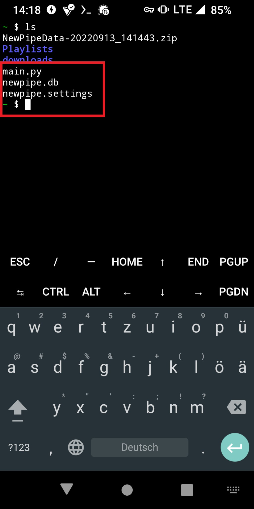

# Android Set Up Guide for NewPipe Playlist Extractor

In this step by step guide will be shown how to use the playlist extractor on your Android phone. This guide uses steps and screenshots of Android 12, other versions should have the same steps only some menus could look a bit different.

## Steps to do before you start with this guide

- Install Termux, you can get it here [F-Droid](https://f-droid.org/en/packages/com.termux/) or here [Google PlayStore](https://play.google.com/store/apps/details?id=com.termux&gl=US)

## Installing Playlist Extractor

I will show every step to show what happens and why it is done, in case that you know your way around the terminal you can scroll to the bottom where you can find the full bash script, that installs the packages, gets the main.py and creates the needed folders. When this is your first time using Termux or the Terminal I recommend following the steps below.

The Python script uses some libraries and packages that first need to be installed on your device.

### 1. Copy and paste the following commands (You can copy all at once, so Termux will install them all together):
```
pkg install root-repo
pkg update
pkg install python
pip install db-sqlite3
pip install pytube
pip install pydub
pkg install ffmpeg
pkg install wget
```
It will look like this:


Now hit enter, Termux will install the packages and prompt you sporadically for input, type "y" and hit enter to proceed if this occurs. After it is finished you can type ```clear``` and hit enter, this clears the terminal window.


### 2. Get the main.py file from the GitHub repository

Now you can download the main.py file into your Termux folder, you can do that too in Termux. We will use the ```wget``` command to do so, copy and paste the following into Termux:
```
wget https://raw.githubusercontent.com/Quasolaris/NewPipePlaylistExtractor/main/Script/main.py
```
This will download the code and saves it into a main.py file on your device, hit enter.


Type ```ls``` and hit enter, this shows all files in your directory, there should now be a main.py listed.


### 3. Creating the Playlist directory

The script needs a Playlist directory to work, for this we create a new directory, copy and paste the following into Termux:
```
mkdir Playlists
```
By using ```ls``` again you should now see a new directory named "Playlists".


### 4. Export your NewPipe Database

Now we are set to use the script, to extract your playlists a NewPipe-Database is needed. To get it we need to export the NewPipe Database by clicking "Export database" under Settings -> Content:


As a save location we choose the Termux workspace:


The database will be saved as a ZIP file inside your Termux directory, now go to your file browser and navigate to your Termux directory. There click the ZIP file, to then select the two files that are inside and extract them also into the Termux folder:
<!--- nice --->


By using ```ls``` you now should have main.py, newpipe.db and newpipe.settings in your directory:



### 5. Run the Extractor 

Now everything should be ready to download your playlists, for that run the following command:

```python main.py newpipe.db```

The extractor should run, read your database and let you choose what to do. It can be that you need to have Termux open and on top to not crash the download.


The playlists will get saved into the Playlist folder, you can then move the folders (named after the playlists) to your music folder, You can also let them inside this folder, but this can have the side effect of filling up your Termux workspace, which is not recommended. 

## Bash script for Termux installation of Extractor

```
pkg install root-repo
pkg update
pkg install python
pip install db-sqlite3
pip install pytube
pip install pydub
pkg install ffmpeg
pkg install wget
wget https://raw.githubusercontent.com/Quasolaris/NewPipePlaylistExtractor/main/Script/main.py
mkdir Playlists
```
After this is finished you can proceed to point 4 of the steps above.